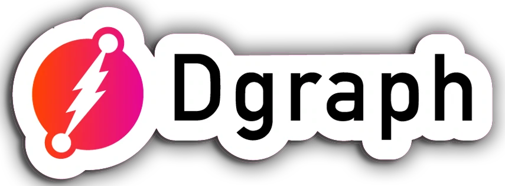

# О курсе

  

Dgraph - Это горизонтально масштабируемая графовая (GraphQL) база данных с открытым кодом, созданная в стартапе Dgraph Labs.

Dgraph обладает следующим рядом преимуществ:

1. Высокая скорость
2. Шардируемость и распределенность
3. Горизонтальное масштабируемость
4. Консистентная реплицируемость (via raft)
5. Высокая доступность
6. Устойчивость
7. Поддержка GraphQL
8. Простой деплой
9. Открытый исходный код
10. Гибкость, простота в использовании
11. Возможность получения бэкапов без остановки системы

Данный курс предназначен для тех, кто хочет научиться использовать данный инструмент.

---

## Курс очень активно пилится, и скоро будет готов