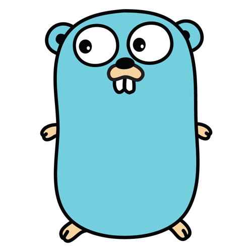

# О курсе

  

[Go (часто также golang)](https://go.dev) — компилируемый многопоточный язык программирования, разработанный внутри компании Google. Разработка Go началась в сентябре 2007 года, его непосредственным проектированием занимались Роберт Гризмер, Роб Пайк и Кен Томпсон, занимавшиеся до этого проектом разработки операционной системы Inferno.

Go обладает рядом плюсов перед другими языками:

- Скорость работы
- Простота в освоении и поддержке
- Масштабируемость приложений
- Инструменты в стандартной библиотеке
- Большое сообщество
- Признание крупными компаниями

---

## О курсе

Данный курс базируется на культовом среди всех программистов изучающих go ресурсе - [tour of go](https://go.dev/tour/welcome/1), однако содержит дополнительные видео-материалы и незначительно измененнную структуру.

После прохождения данного 

---

## План курса

1. *Подготовка*
    1. [Готовим чай, плед и кресло](1.%20Подготовка/1.md)
    1. [Установка go](1.%20Подготовка/2.md)
    1. [Установка VSCode](1.%20Подготовка/3.md)
    1. [Устновка плагинов](1.%20Подготовка/4.md)
1. *База*
    1. [Hello](2.%20База/1.md)
    1. [Пакеты](2.%20База/2.md)
    1. [Импорты](2.%20База/3.md)
    1. [Экспортируемые имена](2.%20База/4.md)
    1. [Функции](2.%20База/5.md)
    1. [Переменные](2.%20База/6.md)
    1. [Инициализация](2.%20База/7.md)
    1. [Типы, дефолт](2.%20База/8.md)
    1. [Константы](2.%20База/9.md)
1. *Операции*
    1. [for](3.%20Операции/1.md)
    1. [if/else](3.%20Операции/2.md)
    1. [switch](3.%20Операции/3.md)
    1. [defer](3.%20Операции/4.md)
    1. [Указатели](3.%20Операции/5.md)
1. *Структурирование*
    1. [Структуры](4.%20Структурирование/1.md)
    1. [Массивы](4.%20Структурирование/2.md)
    1. [Слайсы](4.%20Структурирование/3.md)
    1. [Словари](4.%20Структурирование/4.md)
    1. [Методы](4.%20Структурирование/5.md)
    1. [Интерфейсы](4.%20Структурирование/6.md)
    1. [Операции с типами](4.%20Структурирование/7.md)
    1. [Ошибки](4.%20Структурирование/8.md)
    1. [Reader](4.%20Структурирование/9.md)
1. *Конкуррентность*
    1. [Горутины](5.%20Конкуррентность/1.md)
    1. [Каналы](5.%20Конкуррентность/2.md)
    1. [Буферизованные каналы](5.%20Конкуррентность/3.md)
    1. [select](5.%20Конкуррентность/4.md)
    1. [Пакет sync](5.%20Конкуррентность/5.md)
1. *Бонус*
    1. [Маленький сервер](6.%20Бонус/1.md)
    1. [REST-сервер](6.%20Бонус/2.md)
    1. [REST-клиент](6.%20Бонус/3.md)
    1. [Дженерики](6.%20Бонус/4.md)
