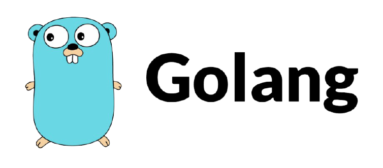

# О курсе

  

[Go (часто также golang)](https://go.dev) — компилируемый многопоточный язык программирования, разработанный внутри компании Google. Разработка Go началась в сентябре 2007 года, его непосредственным проектированием занимались Роберт Гризмер, Роб Пайк и Кен Томпсон, занимавшиеся до этого проектом разработки операционной системы Inferno.

Go обладает рядом плюсов перед другими языками:

- Скорость работы
- Простота в освоении и поддержке
- Масштабируемость приложений
- Инструменты в стандартной библиотеке
- Большое сообщество
- Признание крупными компаниями

---

## Курс очень активно пилится, и скоро будет готов