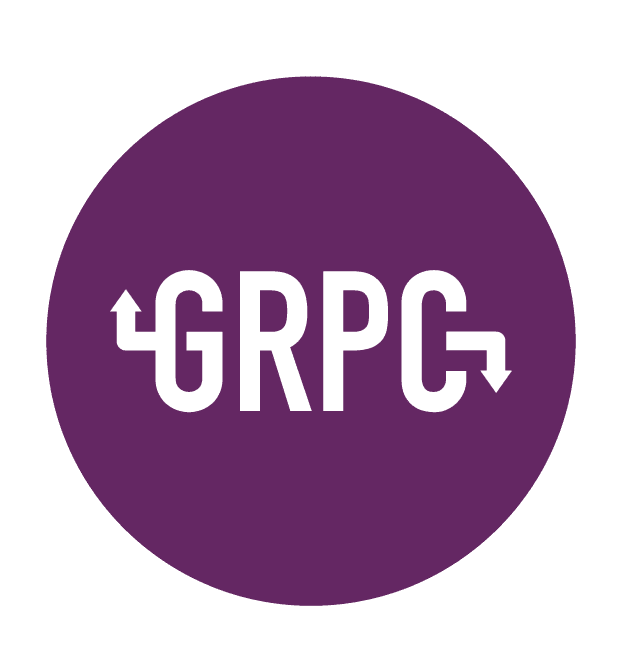

# О курсе

  

Grpc - это протокол вызова удаленных процедур представленный компанией google. gRPC обладает рядом преимуществ в сравнении с другими протоколами передачи данных, за счет чего набирает всё большую популярность. 

---

## Плюсы gRPC:

- HTTP 2
- Бинарный формат передачи данных
- Возможность клиентского/серверного/двунаправленного стриминга
- Быстрая сериализация
- Инструменты поддержки версионирования
- Поддержка большого количества языков
- Клиентская и серверная библиотеки поддерживаются одной компанией

---

## План курса

1. *Подготовка среды*
    1. [История gRPC](a.md)
    1. [Protobuf](b.md)
    1. [Сравнение с другими протоколами](c.md)
    1. [Устновка protoc](d.md)
1. *Go*
    1. [Установка необходимых go пакетов](e.md)
    1. [Сервер go](f.md)
    1. [Клиент go](g.md)
1. *Python*
    1. [Установка необходимых python либ](h.md)
    1. [Сервер python](i.md)
    1. [Клиент python](j.md)
1. *Dart*
    1. [Установка необходимых dart модулей](k.md)
    1. [Сервер dart](l.md)
    1. [Клиент dart](m.md)
