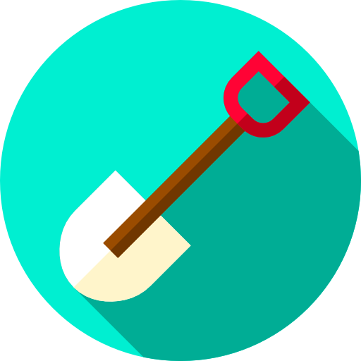

---
hide:
  - navigation
  - toc
---

# О платформе

  

Данный портал предназначен для удобного представления бесплатных обучающих курсов по различным технологиям. Любой желающий может выложить сюда свой обучающий материал, что бы просвятить других в определенной технической области.

Здесь не выдают сертификатов и не берут оплату за курсы, данный портал носит исключительно информационный характер.

--- 
## Зачем нужна еще одна платформа с курсами?

Большая часть платформ с курсами не предоставляют возможности авторам курсов использовать удобные универсальные инструменты для распространения знаний.

Выложить свой курс на данную платформу может любой желающий, и если курс соответствует стандарту платформы, то он будет быстро размещен.

---
## В чем преимущество перед другими платформами?

Все курсы на данной платформе отбираются в ручную и должны соответствовать определенному стандарту:

- Курсы открыты и бесплатны
- Реальный опыт работы с технологией у авторов
- Четкая структура, быстрая навигация
- Последовательное предстваление информации
- Дробление на маленькие информационные блоки
- Примеры кода
- Ссылки на видео
- Инструкции по настройке необходимого окружения (при необходимости)

Если хотя бы одно из условий не будет выполнятся, то курс не будет добавлен на данную платформу.

---

# Где получить помощь по курсу/задать вопрос?

В первую очередь следует покопаться на данных ресурсах самостоятельно:

- google
- stackoverflow
- сайты с официальной документацией по технологии

Умение самостоятельно искать ответы на вопросы (или правильно формулировать их сообществу на *stackoverflow*) помогает быстрее научиться делать самостоятельные реализации.

Если самостоятельно найти ответы на возникающие вопросы не получается, то можно найти себе ментора, который может помочь освоить необходимые технологии (раздел находится в разработке).

---

# Где оставить отзыв/предложение по улучшению портала?

Отзывы и предложения по улучшению портала можно отправить сюда:

**<dangdancheg@gmail.com>**

---

# Как добавить курс?

Что бы добавить свой курс, необходимо пройти следующие шаги:

1. Клонировать себе [репозиторий с обучающими материалами](https://github.com/Dancheg97/recourser)
2. Написать свой курс по аналогии с теми, что уже представлены на платформе:
    - Четкая структура, быстрая навигация
    - Последовательное предстваление информации
    - Дробление на маленькие информационные блоки
    - Примеры кода
    - Ссылки на видео
    - Инструкции по настройке необходимого окружения (при необходимости)
3. Сделать комит и пулл реквест в репозиторий

Далее в случае если курс является подходящим для платформы, то в ближайшее время он появится на платформе.

В случае проблем с созданием курса можно обращаться на почту: **<dangdancheg@gmail.com>**