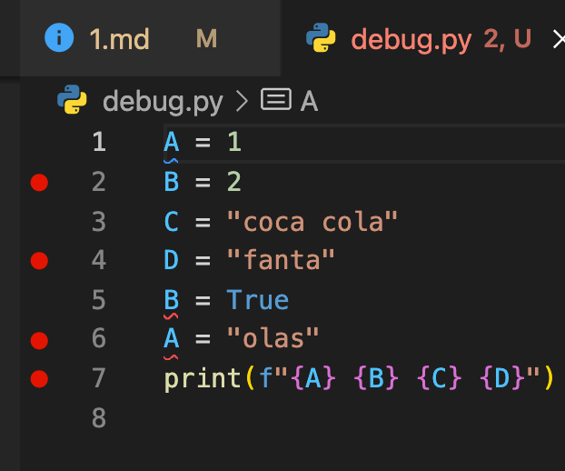

# Дебаг

Дебаг кода - это процесс, который позволяет в процессе работы программы немного лучше понять что происходит на самом деле.

Процесс дебага позволяет посмотреть, какие значения хранятся в памяти на определенном этапе работы программы.

Попробуем разобраться на простом примере. Создадим файл `debug.py` со следующим содержимым:

```python
A = 1
B = 2
C = "coca cola"
D = "fanta"
B = True
A = "olas"
print(f"{A} {B} {C} {D}")
```

Создадим файл с данным кодом. Далее давайте попробуем поставить несколько брейк поинтов. В VSCode это делается нажатием слева от номера строки:

<p align="center">
  
</p>

