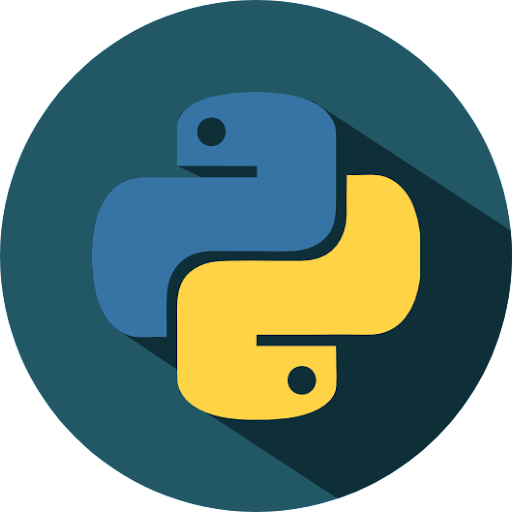

# О курсе

  

[Python](https://www.python.org) - это высокоуровневый язык программирования общего назначения с динамической строгой типизацией и автоматическим управлением памятью.

Один из самых универсальных языков программирования, позволяющих решать практически любые задачи (ps, не всегда в лучшем виде., обладающий огромным количеством библиотек (ps2, не всегда совместимых с вашей версией питона, или вообще рабочих., позволяющий создавать быстрые скрипты для разового отрабатывания, быстро писать микросервисы и работать с REST/SOAP/gRPC, и многое другое.

---

## На кого рассчитан данный курс?

Данный курс позволит разобраться с основными понятиями языка python, получить базис необходимый для написания небольших программ. 

Курс рассчитан на новичков у которых нет опыта программирования, для начала обучения достаточно иметь пк и интернет.

---

## Структура курса

1. *Подготовка среды*
    1. [Готовим чай, плед и свободное время](1.%20Подготовка%20среды/1.md)
    1. [Устанавливаем python](1.%20Подготовка%20среды/2.md)
    1. [Устанавливаем vscode](1.%20Подготовка%20среды/3.md)
    1. [Устанавливаем необходимые плагины](1.%20Подготовка%20среды/4.md)
    1. [Проверяем что всё работает](1.%20Подготовка%20среды/5.md)
1. *Основы python*
    1. [Переменные и типы данных](2.%20Основы%20python/a.md)
    1. [Функции](2.%20Основы%20python/b.md)
    1. [Операторы в python](2.%20Основы%20python/c.md)
    1. [Условия IF/ELSE/ELIF](2.%20Основы%20python/d.md)
    1. [Циклы](2.%20Основы%20python/e.md)
    1. [Установка и использование пакетов](2.%20Основы%20python/f.md)
    1. [Списки, кортежи, словари](2.%20Основы%20python/h.md)
    1. [Операции со строками](2.%20Основы%20python/i.md)
    1. [Операции со списками](2.%20Основы%20python/j.md)
    1. [Try/Except блоки](2.%20Основы%20python/k.md)
1. *Структурирование логики*
    1. [Объекты и классы](3.%20Структурирование/1.md)
    1. [Чтение и запись файлов](3.%20Структурирование/2.md)
    1. [Опциональные параметры функций](3.%20Структурирование/3.md)
    1. [Перегрузки методов и утиная типизацияё](3.%20Структурирование/4.md)
    1. [Стиль кода, линтеры, автоматическое форматирование](3.%20Структурирование/5.md)
1. *Инструменты*
    1. [Дебаг](4.%20Инструменты/1.md)
    1. [Тесты](4.%20Инструменты/2.md)
    1. [Asyncio](4.%20Инструменты/3.md)
    1. [Threading](4.%20Инструменты/4.md)
    1. [Сетевые запросы](4.%20Инструменты/5.md)
    1. [Заключение](4.%20Инструменты/6.md)